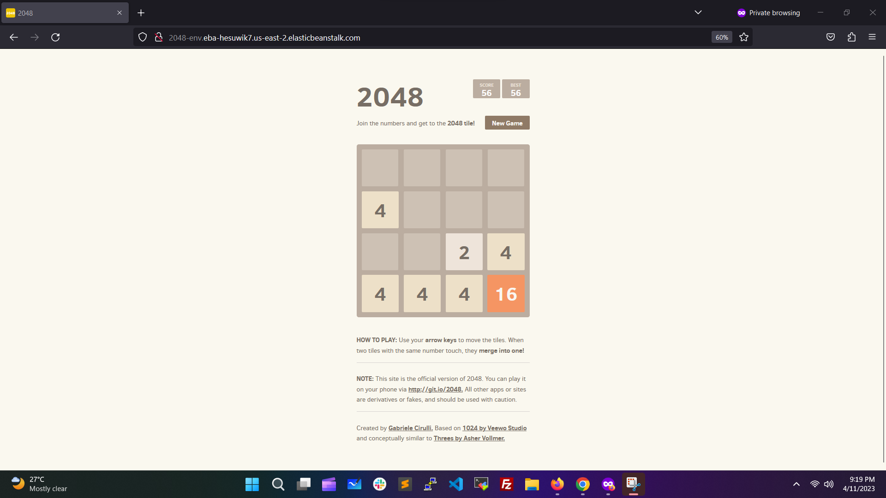

# 2048-game-on-aws-elasticbeanstalk
Deploy 2048 game on AWS Elastic Beanstalk using Docker

### Output Screenshot


### Step for run application.

- Step 1: Install Docker on Computer.

- Step 2: Create Dockerfile. Used Repository Dockerfile.

- Step 3: Create Docker Image.
``` docker build -t 2048-game-aws . ```

- Step 4: Run Container Locally.
``` docker run -d -p 80:80 2048-game-aws:latest ```

- Step 5: Go to AWS Elastic Beanstalk and create an application. Select Docker as Platform and select Upload your code option.

- Step 6: Select the previous step create Dockerfile and upload it.

- Step 7: Finally, click Create Application after that you can get the URL to access this game.